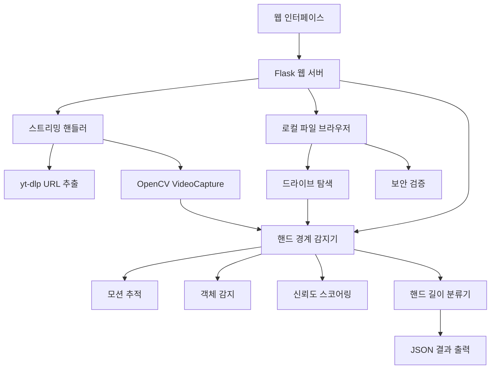

# 🃏 Poker MAM (Media Asset Management) - 포커 대회 영상 분석 시스템

포커 대회 영상에서 AI 기반 핸드 경계 감지 및 길이 분석을 수행하는 종합적인 미디어 자산 관리 시스템입니다. YouTube 스트리밍, 로컬 파일 브라우징, 실시간 분석 기능을 제공합니다.


## 📋 프로젝트 개요

포커 대회 영상에서 AI 기반 핸드 경계 감지 및 길이 분석을 수행하는 종합적인 미디어 자산 관리 시스템입니다. YouTube 스트리밍, 로컬 파일 브라우징, 실시간 분석 기능을 제공합니다.

## 🎯 핵심 기능

### 1. 🎥 멀티 소스 비디오 지원
- **YouTube 스트리밍**: URL에서 직접 스트리밍 분석 (다운로드 불필요)
- **로컬 파일 브라우저**: 네트워크 환경에서 파일 직접 탐색 및 선택
- **파일 업로드**: 로컬 비디오 파일 직접 업로드

### 2. 🤖 AI 기반 핸드 경계 감지
- **다층 감지 아키텍처**: 모션 추적, 객체 감지, 신뢰도 기반 스코어링
- **실시간 분석**: 백그라운드에서 진행률 추적
- **정밀도 조절**: 일반/높음/매우 높음 3단계 분석 옵션

### 3. 📊 핸드 길이 분류 시스템
- **5단계 분류**: 매우 짧음 → 매우 긴 핸드까지 자동 분류
- **상세 통계**: 평균 시간, 분포도, 최장/최단 핸드 정보
- **시각적 결과**: Chart.js 기반 인터랙티브 차트

### 4. 🔒 보안 강화 파일 시스템
- **경로 보안**: 시스템 폴더 및 민감한 파일 접근 차단
- **파일 필터링**: 위험한 파일명 패턴 자동 차단
- **크기 제한**: 최대 10GB 파일 크기 제한

## 🏗️ 시스템 아키텍처



## 📁 프로젝트 구조

```
Archive-MAM/
├── 📄 README.md                          # 프로젝트 메인 문서
├── 📄 requirements.txt                    # Python 종속성
├── 📄 poker_analyzer_app.py              # Flask 메인 애플리케이션
├── 📄 run_poker_app.py                   # 실행 스크립트
├── 📄 test_streaming.py                  # 스트리밍 기능 테스트
│
├── 📂 src/                               # 핵심 소스 코드
│   ├── 🔧 hand_boundary_detector.py      # 핸드 경계 감지 엔진
│   ├── 🌐 streaming_video_handler.py     # 스트리밍 비디오 처리
│   ├── 📁 local_file_browser.py          # 로컬 파일 시스템 브라우저
│   └── 🎯 hand_detection_visualizer.py   # 시각화 도구
│
├── 📂 templates/                         # HTML 템플릿
│   ├── 🌐 base.html                      # 베이스 템플릿
│   ├── 🏠 index.html                     # 메인 페이지
│   └── 📊 results.html                   # 결과 페이지
│
├── 📂 docs/                              # 문서화
│   ├── 📋 hand_detection_plan.md         # 핸드 감지 계획서
│   └── 📄 hand_boundary_detection_detailed.md
│
├── 📂 temp_videos/                       # 임시 비디오 저장소
├── 📂 analysis_results/                  # 분석 결과 저장소
├── 📂 static/results/                    # 정적 결과 파일
└── 📂 test/                             # 테스트 파일
    └── 🧪 test_hand_boundary_detection.py
```

## 🚀 빠른 시작

### 1. 환경 설정

```bash
# 저장소 클론
git clone https://github.com/your-username/Archive-MAM.git
cd Archive-MAM

# Python 가상환경 생성 (권장)
python -m venv venv
source venv/bin/activate  # Windows: venv\Scripts\activate

# 종속성 설치
pip install -r requirements.txt
```

### 2. 시스템 요구사항 확인

```bash
# 시스템 체크
python run_poker_app.py check

# 종속성 자동 설치 (필요시)
python run_poker_app.py install
```

### 3. 애플리케이션 실행

```bash
# 개발 모드 실행
python run_poker_app.py dev

# 프로덕션 모드 실행 (Gunicorn 필요)
python run_poker_app.py prod --port 8000 --workers 4
```

### 4. 웹 브라우저 접속

**http://localhost:5000** 에서 애플리케이션을 사용할 수 있습니다.

## 🎮 사용법

### 1. 비디오 소스 선택

#### 🌐 URL 스트리밍
- YouTube URL 또는 직접 비디오 링크 입력
- 다운로드 없이 실시간 스트리밍 분석

#### 📁 파일 탐색
- 드라이브 선택 후 폴더 탐색
- 비디오 파일 자동 감지 및 하이라이트
- 파일 정보 실시간 표시

#### 📤 파일 업로드
- 로컬 비디오 파일 직접 업로드
- 지원 형식: MP4, AVI, MOV, MKV, FLV, WEBM

### 2. 분석 옵션 설정

- **분석 정밀도**: 일반(빠름) / 높음(권장) / 매우 높음(느림)
- **핸드 길이 분류**: 표준(5단계) / 상세(10단계)

### 3. 결과 확인

- **실시간 진행률**: 분석 진행 상황 모니터링
- **상세 통계**: 핸드 개수, 평균 시간, 분포 차트
- **JSON 다운로드**: 분석 결과 데이터 내보내기

## 🔧 기술 스택

### Backend
- **Python 3.8+**: 메인 개발 언어
- **Flask 2.0+**: 웹 프레임워크
- **OpenCV 4.0+**: 컴퓨터 비전 라이브러리
- **yt-dlp**: YouTube URL 추출
- **Threading**: 백그라운드 작업 처리

### Frontend
- **Bootstrap 5**: 반응형 UI 프레임워크
- **Chart.js**: 데이터 시각화
- **Font Awesome**: 아이콘 세트
- **Vanilla JavaScript**: 클라이언트 사이드 로직

### Computer Vision
- **Background Subtraction**: 배경 차분을 통한 모션 감지
- **Optical Flow**: Lucas-Kanade 방법을 이용한 움직임 추적
- **Contour Detection**: 윤곽선 기반 객체 감지
- **Multi-layer Architecture**: 신뢰도 기반 다층 감지 시스템

## 📊 핸드 길이 분류 기준

| 분류 | 시간 범위 | 색상 코드 | 특징 |
|------|-----------|-----------|------|
| 매우 짧은 핸드 | 0-45초 | 🔴 #ff4444 | 빠른 폴드, Pre-flop 종료 |
| 짧은 핸드 | 45-90초 | 🟠 #ff8800 | Flop에서 종료 |
| 보통 핸드 | 90-180초 | 🟡 #ffcc00 | Turn까지 진행 |
| 긴 핸드 | 180-300초 | 🟢 #88cc00 | River까지 진행 |
| 매우 긴 핸드 | 300초+ | 🔵 #0088cc | 복잡한 의사결정, 올인 상황 |

## 🔒 보안 기능

### 파일 시스템 보안
- **제한된 경로**: 시스템 폴더 접근 차단
  - Windows: `C:\Windows\System32`, `C:\Program Files\WindowsApps`
  - Unix/Linux: `/proc`, `/sys`, `/dev`, `/root`

### 파일명 필터링
- **위험한 패턴**: SSH 키, 비밀번호 파일, 인증서 파일 차단
- **디렉토리 탐색**: `../` 패턴을 통한 경로 탐색 공격 방어

### 리소스 제한
- **파일 크기**: 최대 10GB 제한
- **메모리 사용**: 스트리밍 기반 처리로 메모리 효율성 확보

## 📈 성능 최적화

### 스트리밍 처리
- **Zero Download**: URL에서 직접 스트리밍하여 디스크 공간 절약
- **Progressive Analysis**: 실시간 분석으로 대기 시간 단축
- **Memory Efficient**: 프레임별 처리로 메모리 사용량 최적화

### 멀티스레딩
- **Background Processing**: UI 블로킹 없는 백그라운드 분석
- **Progress Tracking**: 실시간 진행률 업데이트
- **Resource Management**: 자동 리소스 정리 및 해제

## 🧪 테스트

### 단위 테스트 실행
```bash
# 핸드 경계 감지 테스트
python -m pytest test/test_hand_boundary_detection.py -v

# 스트리밍 기능 테스트 (빠른 테스트)
python test_streaming.py --mode quick

# 전체 스트리밍 테스트
python test_streaming.py --mode full
```

### 로컬 파일 브라우저 테스트
```bash
# 파일 브라우저 기능 테스트
python -c "from src.local_file_browser import test_file_browser; test_file_browser()"
```

## 📋 API 문서

### 핵심 엔드포인트

#### 분석 시작
```http
POST /analyze
Content-Type: multipart/form-data

# URL 분석
video_url=https://youtube.com/watch?v=...

# 파일 업로드
video_file=<binary_data>
```

#### 로컬 파일 분석
```http
POST /analyze-local-file
Content-Type: application/json

{
  "file_path": "/path/to/video.mp4"
}
```

#### 진행률 확인
```http
GET /progress/{task_id}

Response:
{
  "status": "analyzing",
  "progress": 45,
  "message": "분석 중... (15개 핸드 감지됨)",
  "video_info": {...}
}
```

#### 결과 조회
```http
GET /results/{task_id}
GET /api/results/{task_id}  # JSON API
GET /download/{task_id}     # 파일 다운로드
```

### 파일 브라우저 API

```http
GET /api/file-browser/drives           # 드라이브 목록
GET /api/file-browser/list?path=...    # 디렉토리 내용
GET /api/file-browser/file-info?path=... # 파일 정보
GET /api/file-browser/validate?path=...  # 파일 유효성 검사
```

## 🔧 환경 변수

```bash
# Flask 설정
FLASK_ENV=development
FLASK_DEBUG=1

# 분석 설정  
MAX_FILE_SIZE=10737418240  # 10GB
TEMP_VIDEO_DIR=temp_videos
RESULTS_DIR=analysis_results

# 보안 설정
RESTRICTED_PATHS=C:\Windows\System32,/proc,/sys
```

## 🚀 배포 옵션

### Docker 배포 (권장)
```dockerfile
# Dockerfile 예시
FROM python:3.9-slim

WORKDIR /app
COPY requirements.txt .
RUN pip install -r requirements.txt

COPY . .
EXPOSE 5000

CMD ["python", "run_poker_app.py", "prod"]
```

### 클라우드 배포
- **Heroku**: `git push heroku main`
- **AWS EC2**: Gunicorn + Nginx 조합
- **Google Cloud Run**: 컨테이너 기반 배포
- **Azure Container Instances**: 빠른 컨테이너 배포

## 🤝 기여 방법

1. **Fork** 저장소
2. **Feature Branch** 생성: `git checkout -b feature/amazing-feature`
3. **Commit** 변경사항: `git commit -m 'Add amazing feature'`
4. **Push** to Branch: `git push origin feature/amazing-feature`
5. **Pull Request** 생성

### 개발 가이드라인
- **코드 스타일**: PEP 8 준수
- **커밋 메시지**: Conventional Commits 형식
- **테스트**: 새로운 기능은 반드시 테스트 코드 포함
- **문서화**: README 및 인라인 주석 업데이트

## 📄 라이선스

이 프로젝트는 MIT 라이선스 하에 배포됩니다. 자세한 내용은 [LICENSE](LICENSE) 파일을 참조하세요.

## 🙋‍♂️ 지원 및 문의

- **Issues**: [GitHub Issues](https://github.com/your-username/Archive-MAM/issues)
- **Discussions**: [GitHub Discussions](https://github.com/your-username/Archive-MAM/discussions)
- **Wiki**: [프로젝트 Wiki](https://github.com/your-username/Archive-MAM/wiki)

## 📚 추가 문서

- [📋 핸드 감지 상세 계획서](docs/hand_detection_plan.md)
- [🔍 경계 감지 알고리즘 상세](docs/hand_boundary_detection_detailed.md)
- [🎯 시각화 가이드](docs/visualization_guide.md)
- [🚀 배포 가이드](docs/deployment_guide.md)

## 🏆 주요 특징 요약

✅ **무다운로드 스트리밍**: YouTube/직접 URL에서 즉시 분석  
✅ **로컬 네트워크 지원**: 안전한 파일 시스템 탐색  
✅ **실시간 분석**: 백그라운드 처리 + 진행률 표시  
✅ **AI 기반 감지**: 다층 아키텍처로 정확한 핸드 경계 감지  
✅ **보안 강화**: 시스템 파일 보호 + 경로 탐색 방어  
✅ **반응형 UI**: 모바일/데스크톱 친화적 인터페이스  
✅ **확장 가능**: 모듈화된 구조로 기능 확장 용이  

---

**🃏 Poker MAM**은 포커 대회 영상 분석의 새로운 표준을 제시합니다. 
전문적인 분석 도구부터 일반 사용자를 위한 직관적 인터페이스까지, 
모든 요구사항을 충족하는 종합 솔루션입니다.

**⭐ Star**를 눌러주시고 **🔗 Fork**하여 함께 발전시켜나가요!