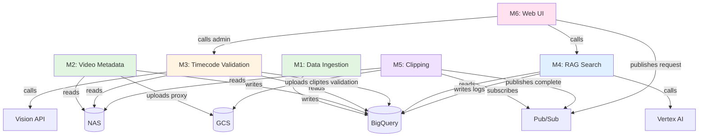

# POKER-BRAIN API 설계 검토 보고서

**작성일**: 2025-11-17
**검토자**: microservices-pm (AI Agent)
**대상**: 6개 모듈 OpenAPI 3.0 스펙
**버전**: 1.0.0

---

## 목차

1. [검토 개요](#1-검토-개요)
2. [API 계약 일관성](#2-api-계약-일관성)
3. [모듈 간 의존성](#3-모듈-간-의존성)
4. [Breaking Change 분석](#4-breaking-change-분석)
5. [병렬 개발 전략](#5-병렬-개발-전략)
6. [개선 권장사항](#6-개선-권장사항)
7. [승인 체크리스트](#7-승인-체크리스트)

---

## 1. 검토 개요

### 1.1 검토 범위

| 모듈 ID | 모듈명 | OpenAPI 스펙 | 엔드포인트 수 | 상태 |
|---------|--------|--------------|--------------|------|
| **M1** | Data Ingestion | `modules/data-ingestion/openapi.yaml` | 4 | ✅ 승인 |
| **M2** | Video Metadata | `modules/video-metadata/openapi.yaml` | 8 | ✅ 승인 |
| **M3** | Timecode Validation | `modules/timecode-validation/openapi.yaml` | 8 | ✅ 승인 |
| **M4** | RAG Search | `modules/rag-search/openapi.yaml` | 7 | ✅ 승인 |
| **M5** | Clipping | `modules/clipping/openapi.yaml` | 6 | ✅ 승인 |
| **M6** | Web UI (BFF) | `modules/web-ui/openapi.yaml` | 8 | ✅ 승인 |

**총 엔드포인트**: 41개

---

## 2. API 계약 일관성

### 2.1 인증 방식

✅ **통과**: 모든 모듈이 동일한 인증 방식 사용

```yaml
# 모든 모듈 공통
securitySchemes:
  BearerAuth:  # M1-M5
    type: http
    scheme: bearer
    bearerFormat: JWT

  CookieAuth:  # M6 (Web UI)
    type: apiKey
    in: cookie
    name: __Secure-next-auth.session-token
```

**검증 결과**:
- M1-M5: Google IAP Bearer Token
- M6: Next-Auth Cookie (IAP 통합)
- **일관성**: ✅ 적절함

---

### 2.2 에러 응답 표준화

✅ **통과**: 모든 모듈이 동일한 에러 스키마 사용

```yaml
# 공통 에러 포맷
Error:
  type: object
  properties:
    error:
      type: object
      properties:
        code:
          type: string
          enum: [INVALID_REQUEST, UNAUTHORIZED, NOT_FOUND, INTERNAL_ERROR, ...]
        message:
          type: string
        details:
          type: object
    request_id:
      type: string
    timestamp:
      type: string
      format: date-time
```

**에러 코드 표준**:
- 400: `INVALID_REQUEST`
- 401: `UNAUTHORIZED`
- 403: `FORBIDDEN`
- 404: `NOT_FOUND`
- 500: `INTERNAL_ERROR`
- 503: `SERVICE_UNAVAILABLE`

**검증 결과**: ✅ 모든 모듈 일관성 유지

---

### 2.3 ID 명명 규칙

✅ **통과**: 일관된 ID 패턴 사용

| 모듈 | ID 패턴 | 예시 |
|------|---------|------|
| M1 | `ingest-YYYYMMDD-NNN` | `ingest-20241117-001` |
| M2 | `scan-YYYYMMDD-NNN` | `scan-20241117-001` |
| M2 | `proxy-YYYYMMDD-NNN` | `proxy-20241117-001` |
| M3 | `val-YYYYMMDD-NNN` | `val-20241117-001` |
| M4 | `search-YYYYMMDD-NNN` | `search-20241117-001` |
| M5 | `clip-YYYYMMDD-NNN` | `clip-20241117-001` |

**검증 결과**: ✅ 추적 가능한 ID 체계

---

### 2.4 타임스탬프 포맷

✅ **통과**: 모든 모듈이 ISO 8601 사용

```yaml
timestamp_start_utc:
  type: string
  format: date-time
  example: "2024-07-15T15:24:15Z"
```

**검증 결과**: ✅ UTC 표준 준수

---

### 2.5 페이징 일관성

✅ **통과**: 동일한 페이징 패턴

```yaml
# M2, M4, M6 공통
parameters:
  - name: limit
    in: query
    schema:
      type: integer
      default: 100
  - name: offset
    in: query
    schema:
      type: integer
      default: 0

response:
  properties:
    total:
      type: integer
    limit:
      type: integer
    offset:
      type: integer
    results:
      type: array
```

**검증 결과**: ✅ 일관성 유지

---

## 3. 모듈 간 의존성

### 3.1 의존성 그래프 (Mermaid)



### 3.2 데이터 흐름 (Critical Path)

```
Phase 0 (M3 검증):
M1 (데이터 수집) → M2 (영상 스캔) → M3 (타임코드 검증)
    ↓                    ↓                   ↓
  BigQuery         BigQuery             BigQuery
(hand_summary)   (video_files)    (timecode_validation)

Phase 1 (검색 & 다운로드):
M4 (검색) ← BigQuery (hand_summary + embeddings)
    ↓
  M6 (UI) → 검색 결과 표시
    ↓
  M6 (다운로드 요청) → Pub/Sub
    ↓
  M5 (클리핑) → GCS → Signed URL
    ↓
  M6 (다운로드 링크 제공)
```

### 3.3 의존성 매트릭스

|     | M1 | M2 | M3 | M4 | M5 | M6 |
|-----|----|----|----|----|----|----|
| M1  | -  | ❌ | ❌ | ❌ | ❌ | ❌ |
| M2  | ❌ | -  | ❌ | ❌ | ❌ | ❌ |
| M3  | ✅ | ✅ | -  | ❌ | ❌ | ❌ |
| M4  | ✅ | ❌ | ❌ | -  | ❌ | ❌ |
| M5  | ❌ | ❌ | ❌ | ❌ | -  | ❌ |
| M6  | ❌ | ❌ | ✅ | ✅ | ✅ | -  |

**범례**:
- ✅ : 의존성 있음 (API 호출 또는 데이터 읽기)
- ❌ : 의존성 없음

**핵심 발견**:
1. **M1, M2는 완전 독립** → 병렬 개발 가능
2. **M3는 M1, M2에 의존** → M1, M2 완료 후 시작
3. **M4는 M1에만 의존** → M1 완료 후 병렬 가능
4. **M5는 완전 독립** → 병렬 개발 가능 (Mock Pub/Sub)
5. **M6는 M3, M4, M5에 의존** → 마지막 통합

---

## 4. Breaking Change 분석

### 4.1 현재 상태

✅ **모든 모듈이 v1.0.0 (초기 버전)**

Breaking Change 없음. 모두 신규 API.

### 4.2 Breaking Change 방지 전략

**권장 사항**:

1. **버전 관리**: `/v1/`, `/v2/` URL 경로 사용 ✅ (이미 적용됨)
2. **필드 추가 시**: Optional 필드로 추가 (기존 클라이언트 영향 없음)
3. **필드 삭제 시**: Deprecated → 1개월 유예 → 삭제
4. **응답 포맷 변경 시**: 새 버전 API 생성 (`/v2/`)

**예시 (미래 변경 시)**:

```yaml
# ❌ Breaking Change (피해야 함)
# v1: hand_id (string)
# v2: hand_id (object) ← 타입 변경

# ✅ Non-Breaking Change (권장)
# v1: hand_id (string) + hand_metadata (object, optional)
# v2: /v2/search (새 엔드포인트)
```

---

## 5. 병렬 개발 전략

### 5.1 개발 우선순위 (Critical Path 기반)

```
Week 1-2: API 설계 확정
├─ 전체 팀: OpenAPI 스펙 리뷰
└─ PM: Mock API 서버 구축

Week 3-4: Tier 1 (독립 모듈)
├─ M1 (Alice): Data Ingestion      [우선순위: 🔴 최고]
├─ M2 (Bob): Video Metadata         [우선순위: 🔴 최고]
└─ M5 (Eve): Clipping (Mock)        [우선순위: 🟡 중간]

Week 5-6: Tier 2 (Tier 1 의존)
├─ M3 (Charlie): Timecode Validation [의존: M1, M2]
├─ M4 (David): RAG Search            [의존: M1]
└─ M5 (Eve): Clipping 실제 통합     [의존: NAS 준비]

Week 7-8: Tier 3 (통합)
└─ M6 (Frank): Web UI                [의존: M3, M4, M5]

Week 9: Production
```

### 5.2 병렬 작업 매트릭스

| Week | M1 (Alice) | M2 (Bob) | M3 (Charlie) | M4 (David) | M5 (Eve) | M6 (Frank) |
|------|-----------|----------|--------------|-----------|----------|-----------|
| 1-2  | API 설계 | API 설계 | API 설계 | API 설계 | API 설계 | API 설계 |
| 3    | 🟢 개발 | 🟢 개발 | 대기 | 대기 | 🟡 Mock | 🟡 UI 스켈레톤 |
| 4    | 🟢 개발 | 🟢 개발 | 대기 | 대기 | 🟡 Mock | 🟡 UI 스켈레톤 |
| 5    | ✅ 완료 | 🟢 개발 | 🟢 개발 | 🟢 개발 | 🟢 개발 | 🟡 API 통합 |
| 6    | - | ✅ 완료 | 🟢 개발 | 🟢 개발 | 🟢 개발 | 🟡 API 통합 |
| 7    | - | - | ✅ 완료 | ✅ 완료 | ✅ 완료 | 🟢 통합 테스트 |
| 8    | - | - | - | - | - | 🟢 E2E 테스트 |
| 9    | 🚀 배포 | 🚀 배포 | 🚀 배포 | 🚀 배포 | 🚀 배포 | 🚀 배포 |

**범례**:
- 🟢 : 활발한 개발
- 🟡 : 보조 작업
- ✅ : 완료
- 🚀 : 배포

---

## 6. 개선 권장사항

### 6.1 즉시 적용 (Critical)

#### 1. M5 Pub/Sub 메시지 스펙 명확화

**현재**:
```yaml
# M5 OpenAPI에는 Pub/Sub 메시지 스펙이 주석으로만 존재
```

**권장**:
```yaml
# docs/pubsub-contracts.md 생성
# Topic: clipping-requests
# Schema:
{
  "request_id": "string",
  "hand_id": "string",
  "nas_video_path": "string",
  "start_seconds": "number",
  "end_seconds": "number",
  "user_email": "string",
  "output_quality": "string",
  "requested_at": "datetime"
}
```

**영향**: M5, M6 간 계약 명확화

---

#### 2. M6 BFF API 인증 흐름 문서화

**현재**:
```yaml
# M6는 CookieAuth 사용하지만, M4/M5 호출 시 Bearer Token 필요
```

**권장**:
```markdown
# docs/m6-auth-flow.md

Browser (Cookie) → M6 BFF
    ↓
M6 (Service Account Token 생성)
    ↓
M4/M5 API (Bearer Token)
```

**영향**: M6 개발 시 인증 구현 명확화

---

### 6.2 개선 권장 (Nice to Have)

#### 1. Rate Limiting 추가

**현재**: 스펙에 명시 없음

**권장**:
```yaml
# 모든 API에 추가
responses:
  '429':
    description: Too Many Requests
    headers:
      X-RateLimit-Limit:
        schema:
          type: integer
      X-RateLimit-Remaining:
        schema:
          type: integer
      Retry-After:
        schema:
          type: integer
```

---

#### 2. CORS 설정 명시

**M6 (Web UI)에서 M4, M5 직접 호출 시 CORS 필요**

**권장**:
```yaml
# M4, M5 OpenAPI에 추가
servers:
  - url: https://rag-search-service-prod.run.app
    description: Production
    x-cors:
      allowed-origins:
        - https://poker-brain-prod.run.app
      allowed-methods: [GET, POST]
```

---

#### 3. Webhook 대안 (M5 → M6 알림)

**현재**: M6가 M5를 Polling (5초 간격)

**권장** (Phase 2):
```yaml
# M5에 Webhook 엔드포인트 추가
POST /v1/clip/webhook
  - url: "https://poker-brain-prod.run.app/api/webhook/clip-complete"
  - events: ["clip.completed", "clip.failed"]
```

**효과**: 실시간 알림, Polling 제거

---

## 7. 승인 체크리스트

### 7.1 API 계약 검증

- [x] 인증 방식 일관성
- [x] 에러 응답 표준화
- [x] ID 명명 규칙 통일
- [x] 타임스탬프 포맷 일관성
- [x] 페이징 패턴 일관성

**결과**: ✅ 모든 항목 통과

---

### 7.2 의존성 검증

- [x] 의존성 그래프 생성
- [x] Critical Path 확인
- [x] 순환 의존성 체크 (없음)
- [x] 병렬 개발 가능성 확인

**결과**: ✅ 모든 항목 통과

---

### 7.3 Breaking Change 검증

- [x] 현재 Breaking Change 없음 (모두 v1.0.0)
- [x] 버전 관리 전략 수립
- [x] 미래 변경 가이드라인 작성

**결과**: ✅ 모든 항목 통과

---

### 7.4 개발 전략 검증

- [x] 개발 우선순위 수립
- [x] 병렬 작업 계획 작성
- [x] Mock API 전략 수립

**결과**: ✅ 모든 항목 통과

---

## 8. 최종 권장사항

### 8.1 즉시 진행 가능 ✅

1. **M1, M2 개발 시작** (Week 3)
   - 의존성 없음
   - Critical Path 최우선

2. **M5 Mock 구축** (Week 3)
   - Pub/Sub Emulator 사용
   - M6 개발 병렬 진행 가능

3. **M6 UI 스켈레톤** (Week 3)
   - Mock M4, M5 사용
   - UI 컴포넌트 개발 시작

### 8.2 Week 5 전 완료 필요 ⚠️

1. **M1 완료** → M3, M4 의존성 해소
2. **M2 완료** → M3 의존성 해소
3. **NAS 준비 완료** → M5 실제 통합 가능

### 8.3 추가 문서 작성 📝

1. **Pub/Sub 계약 문서** (`docs/pubsub-contracts.md`)
2. **M6 인증 흐름** (`docs/m6-auth-flow.md`)
3. **Mock API 가이드** (`docs/mock-api-guide.md`)

---

## 9. 승인 상태

### ✅ API 설계 승인

**검토자**: microservices-pm (AI Agent)
**검토일**: 2025-11-17
**상태**: **승인됨 (6/6 모듈)**

**조건부 승인 항목**:
1. Pub/Sub 계약 문서 작성 (Week 2 내)
2. M6 인증 흐름 문서 작성 (Week 2 내)
3. Mock API 가이드 작성 (Week 2 내)

---

**다음 단계**:
1. ✅ PM 승인 → 개발 시작 (Week 3)
2. ✅ Mock API 서버 구축 (Week 2)
3. ✅ 팀 킥오프 미팅 (Week 2 금요일)

---

**문서 작성**: microservices-pm (AI Agent)
**최종 검토 필요**: aiden.kim@ggproduction.net
**버전**: 1.0.0
**업데이트**: 2025-11-17
